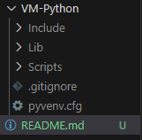
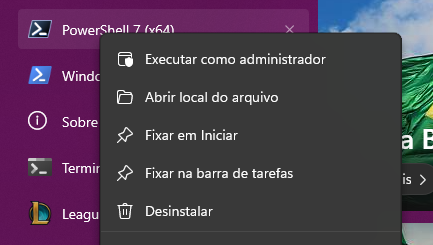
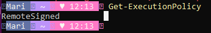
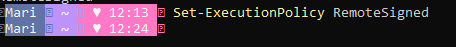
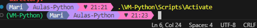

## Configuração de Ambiente
### 1ª  ETAPA
1. Instalar [Python](https://www.python.org/) (*Versão utilizada é a Python 3.13.0*): 

2. Instalar [Visual Studio Code](https://code.visualstudio.com/): 
    
    - **Adicionar a extensão Pylance:** Ajuda com sugestões de código inteligentes e rápidas. Detecta erros, exibe informações da documentação da linguagem diretamente no editor, segere adição automática das improtações necessárias.

    - **Adicionar a extensão Python:** Executa o código diretamente no terminal integrado do VS Code. Também possui complementação de código e sugestões inteligentes. Detecta automaticamente ambiente virtuais e interpretes instalados.
    Após instalar a extensão, você precisa selecionar o interpretador Python correto:

       -  Pressione *Ctrl+Shift+P* para abrir a paleta de comandos. 
       - Digite e selecione *Python: Select Interpreter*. 
       - Escolha o interpretador desejado na lista (como um ambiente virtual ou Conda).

### 2ª  ETAPA
Instalar ambiente virtual para que seja possível instalar as dependências do Python.

` python -m venv <nome-que-desejar>`

No terminal, coloquei da seguinte forma: 

No VS Code, ele cria um diretório da VM:

## IMPORTANTE

>> O Windows bloqueia de forma automática Scripts de terceiros. Precisa ajustar a configuração do sistema, para que permita que scripts em Python seja executado sem falhas.
Para iniciar esse ajuste, precisa visualizar a política do windows. 

>> Abra o terminal poweshell em modo administrador:

e digite o comando abaixo: 
`Get-ExecutionPolicy`

Esse comando irá retornar uma das opções abaixo: 
**RemoteSigned:** Essa opção permite a execução de Script, porém bloqueia downloads externos. _(Essa é a opção ideal)_   
**Unrestricted:** Permite qualquer ação. _(Essa opção apresenta um certo risco)_
**Restricted:** Não permite ações de scripts _(Essa geralmente é a opção padrão)_  

>> Caso retorne **Unrestricted** ou **Restricted**  é só digitar o comando abaixo no powershell para alterar:
`Set-ExecutionPolicy RemoteSigned`

Agora é só ativar o ambiente usando o comando abaixo:

`.\nome-da-pasta-criada\Script\Activate>`

No terminal, coloquei da seguinte forma e em seguida já mostra a VM ativa: 

### Instalando Dependências

Nesse pequeno projeto, vamos utilizas algumas dependências/frameworks.

O primeiro deles é o **FastAPI** com o **Uvicorn**. 
Os dois juntos se complementam, pois o  FastAPI fornece as ferramentas necessárias para construir a lógica e as rotas da aplicação, mas ele não pode por si só, gerenciar as conexões HTTP. É nesse momento que entra o Uvicorn, que atua como o servidor para a aplicação.

Com o comando abaixo, iniciamos a instalação:

`pip install fastapi uvicorn`

O segundo é o **sqlalchemy**, que é uma biblioteca para trabalhar com banco de dados em Python. Ela oferece ferramentas que facilitam a integração com banco de dados relacionais (**PostgreSQL, MySQL, SQLite**).

`pip install sqlalchemy`

O terceiro é o **psycopg2-binary**, que é um pacote do Python usado para conexões com banco de dados, para instalá-lo é só usar o comando abaixo:

`pip install psycopg2-binary`
